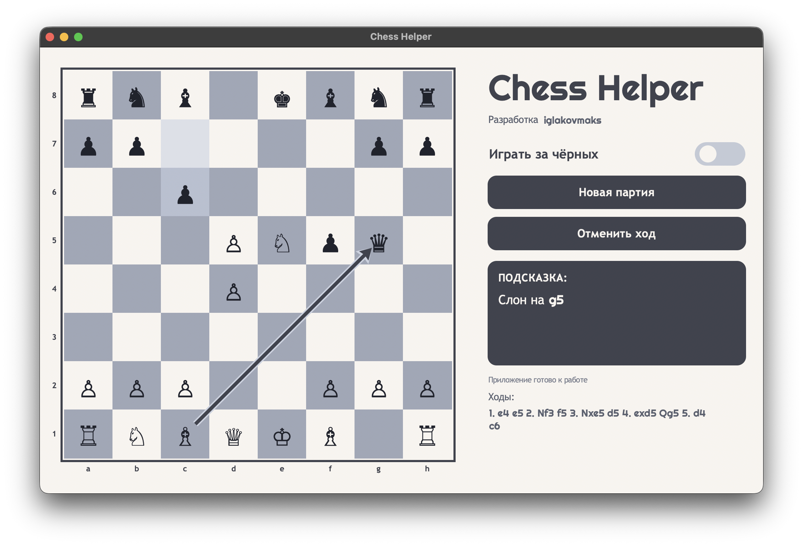

# Chess Helper

Chess Helper is a desktop app with an interactive chessboard and automatic best-move suggestions powered by Stockfish.

Russian version: [README_RU.md](README_RU.md)

## Download

- Project website: **https://iglakovmaks.github.io/chess_helper_site/**
- macOS: `ChessHelper.dmg`
- Windows: `ChessHelper-Setup.exe`
- macOS direct link: `https://github.com/iglakovmaks/chess_helper/releases/download/windows-latest/ChessHelper.dmg`
- Windows direct link: `https://github.com/iglakovmaks/chess_helper/releases/download/windows-latest/ChessHelper-Setup.exe`

<p align="center">
  
</p>

## Features

- Manual position input on the board (clicks and drag-and-drop).
- Side toggle: play as White or Black.
- Automatic best-move suggestion for the current position.
- Visual recommended-move arrow on the board.
- Move history, `New Game`, `Undo Move`.
- Pawn promotion pop-up with piece selection.
- Offline analysis via local Stockfish engine.

## Tech Stack

- Python 3
- Tkinter
- python-chess
- Stockfish (UCI)
- PyInstaller

## Development Run

```bash
python3 -m venv .venv
source .venv/bin/activate
pip install -r requirements.txt
python app.py
```

## Build Application

Important: build on the same OS you target for distribution.

```bash
python -m pip install -r requirements.txt -r requirements-build.txt
python build_app.py
```

Options:

```bash
python build_app.py --stockfish /path/to/stockfish
python build_app.py --icon /path/to/icon
python build_app.py --no-zip
```

### Windows (Automated Local Build)

```powershell
powershell -ExecutionPolicy Bypass -File .\build_windows.ps1
```

Options:

```powershell
powershell -ExecutionPolicy Bypass -File .\build_windows.ps1 -StockfishPath C:\path\to\stockfish.exe
powershell -ExecutionPolicy Bypass -File .\build_windows.ps1 -NoZip
```

### Windows via GitHub Actions

This repository includes workflow: `.github/workflows/build-windows.yml`.

- Run: **Actions -> Build Windows Release -> Run workflow**
- Result: `ChessHelper-Setup.exe` is uploaded to GitHub Release tag `windows-latest`.
- Stable download URL: `https://github.com/iglakovmaks/chess_helper/releases/download/windows-latest/ChessHelper-Setup.exe`

## Repository Structure

- `app.py` - main application.
- `build_app.py` - PyInstaller build script.
- `build_windows.ps1` - local automated Windows build.
- `ChessHelperInstaller.iss` - Inno Setup script for `.exe` installer.
- `website/` - landing page and download site styles.

## Note

Build artifacts (`dist/`, `build/`, `release/`, `website/downloads/`) are excluded from the repository and are not stored in source control.

## Author

- GitHub: https://github.com/iglakovmaks

## License

MIT License. See `LICENSE`.
